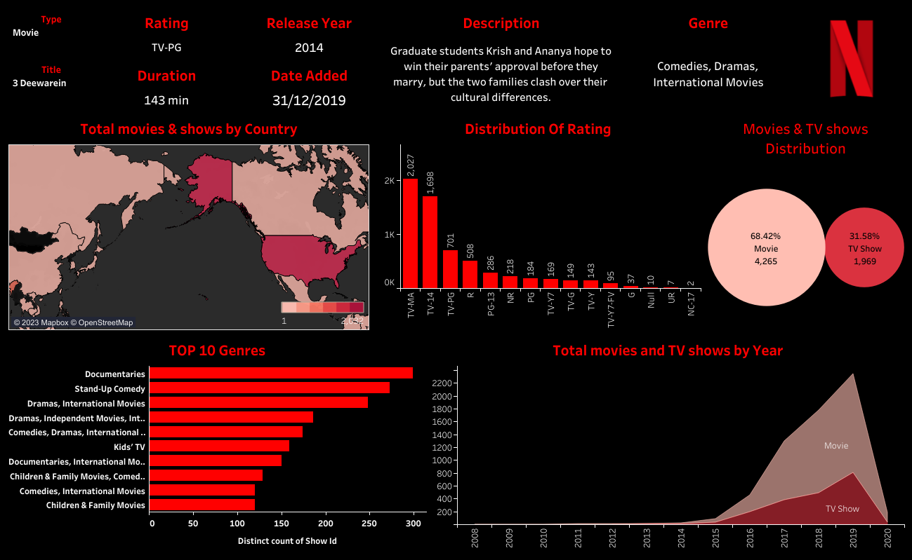

# Neflix Analysis

## Overview

This repository contains a dashboard for Netflix consumption data. The dashboard provides visual insights into the TV shows and movies by country, ratings, Top most watched genre distributions
## Features

- Visual representations of Netflix consumption data
- Interactive charts and graphs
- Filter options for customized analysis

## Dashboard Preview

## Dashboard Components

### 1. Top movies and shows by Country Overview
This section provides an overview of countries where shows are viewed most. 

### 2. Top genre
Visualizes the most watched genres with documentaries and stand-up comedy top the chart.

### 3. Top movies and shows by year
Analyzes movies and TV shows, More Movies were released than shows, especially in 2019.

## Technologies Used

- Tableau

